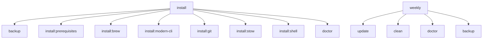

# 🚀 Task Runner Documentation

A modern replacement for Make using [Task](https://taskfile.dev) to orchestrate your dotfiles automation.

## 📦 Installation

```bash
# Install Task runner
brew install go-task

# Verify installation
task --version
```

## 🎯 Quick Start

```bash
# Show all available tasks
task --list

# Get detailed help
task help

# Full installation (new system)
task install

# Update everything
task update

# System health check
task doctor

# Create backup
task backup
```

## 📋 Task Categories

### 🛠️ Installation & Setup
| Task | Description | Usage |
|------|-------------|--------|
| `install` | Complete dotfiles installation | `task install` |
| `bootstrap` | Bootstrap new system from scratch | `task bootstrap` |
| `install:brew` | Install Homebrew packages | `task install:brew` |
| `install:modern-cli` | Setup modern CLI tools | `task install:modern-cli` |
| `install:git` | Setup Git enhancements | `task install:git` |
| `install:stow` | Create symlinks with Stow | `task install:stow` |

### 📦 Package Management
| Task | Description | Usage |
|------|-------------|--------|
| `brew` | Interactive Homebrew management | `task brew` |
| `brew:update` | Update all packages | `task brew:update` |
| `brew:sync` | Sync Brewfile with system | `task brew:sync` |
| `brew:cleanup` | Clean old packages | `task brew:cleanup` |
| `npm:global` | Install global npm packages | `task npm:global` |
| `deps` | Update all dependencies | `task deps` |

### 🔧 Git Workflows
| Task | Description | Usage |
|------|-------------|--------|
| `git:status` | Enhanced dotfiles status | `task git:status` |
| `git:sync` | Sync with remote | `task git:sync` |
| `commit` | Smart commit with staging | `task commit` |

### 🎨 Editor Configuration
| Task | Description | Usage |
|------|-------------|--------|
| `nvim:sync` | Sync Neovim plugins | `task nvim:sync` |
| `nvim:update` | Update Neovim plugins | `task nvim:update` |
| `nvim:health` | Check Neovim health | `task nvim:health` |
| `tmux:reload` | Reload tmux config | `task tmux:reload` |
| `tmux:plugins` | Install/update tmux plugins | `task tmux:plugins` |

### 🏥 System Maintenance
| Task | Description | Usage |
|------|-------------|--------|
| `doctor` | Complete system health check | `task doctor` |
| `clean` | Clean system caches | `task clean` |
| `backup` | Create timestamped backup | `task backup` |
| `restore` | Restore from backup | `task restore` |
| `weekly` | Run weekly maintenance | `task weekly` |

### ⚙️ Configuration Management
| Task | Description | Usage |
|------|-------------|--------|
| `config` | Interactive config editor | `task config` |
| `configure` | Apply all configurations | `task configure` |
| `fix:permissions` | Fix file permissions | `task fix:permissions` |
| `fix:links` | Fix broken symlinks | `task fix:links` |

### ⚡ Quick Shortcuts
| Task | Description | Usage |
|------|-------------|--------|
| `b` | Quick backup | `task b` |
| `c` | Quick commit | `task c` |
| `d` | Quick doctor | `task d` |
| `u` | Quick update | `task u` |
| `s` | Quick status | `task s` |

## 🔄 Common Workflows

### New System Setup
```bash
# Bootstrap everything from scratch
task bootstrap
```

### Daily Development
```bash
# Check system health
task d

# Update everything
task u

# Commit changes
task c
```

### Weekly Maintenance
```bash
# Complete maintenance routine
task weekly
```

### Configuration Editing
```bash
# Interactive config selection
task config

# Apply changes
task configure
```

## 🎨 Features

### 🌈 Colored Output
- **Blue** `[INFO]` - Informational messages
- **Green** `✅` - Success messages  
- **Yellow** `⚠️` - Warnings
- **Red** `❌` - Errors
- **Cyan** - Headers and titles

### 🛡️ Safety Features
- **Automatic backups** before destructive operations
- **Dry-run modes** for testing
- **Interactive confirmations** for dangerous tasks
- **Status checks** before execution
- **Dependency management** between tasks

### 🚀 Performance
- **Parallel execution** where possible
- **Smart caching** with `when_changed`
- **Conditional execution** with status checks
- **Minimal overhead** compared to shell scripts

### 🔧 Integration
- **Seamless integration** with existing scripts
- **Preserves current automation** while adding orchestration
- **Environment variable** management
- **Cross-platform compatibility**

## 📊 Task Dependencies



## 🔍 Advanced Usage

### Custom Variables
```yaml
# Override default variables
task install DOTFILES_ROOT=/custom/path
```

### Environment Variables
```bash
# Set permanent environment
export HOMEBREW_BUNDLE_FILE=/custom/Brewfile
task brew:sync
```

### Task Composition
```bash
# Chain multiple tasks
task backup && task update && task doctor
```

### Interactive Mode
```bash
# Run interactive tasks
task config    # Choose configuration to edit
task brew      # Interactive Homebrew management
task restore   # Choose backup to restore
```

## 🐛 Troubleshooting

### Task Not Found
```bash
# Check available tasks
task --list-all

# Verify Taskfile.yml location
ls -la Taskfile.yml
```

### Permission Issues
```bash
# Fix permissions
task fix:permissions

# Reset and reinstall
task reset
task install
```

### Broken Dependencies
```bash
# Check system health
task doctor

# Clean and reinstall
task clean
task install:brew
```

### Backup Recovery
```bash
# List available backups
task restore

# Manual backup extraction
cd ~/.dotfiles/backup
tar -xzf dotfiles_TIMESTAMP.tar.gz
```

## 📈 Migration from Make

### Makefile → Taskfile.yml Benefits

| Make | Task |
|------|------|
| Platform-specific | Cross-platform |
| Complex syntax | YAML-based |
| No built-in colors | Rich output |
| Basic dependencies | Smart dependencies |
| Shell-only | Multi-language support |
| No interactive mode | Built-in interactivity |

### Migration Steps
1. **Install Task**: `brew install go-task`
2. **Review tasks**: `task --list`
3. **Test functionality**: `task doctor`
4. **Remove old Makefile**: `rm Makefile` (if exists)
5. **Update documentation**: Reference `task` instead of `make`

## 🎯 Best Practices

### Task Design
- **Keep tasks focused** - One responsibility per task
- **Use descriptive names** - Clear purpose and scope
- **Add descriptions** - Help users understand what tasks do
- **Include status checks** - Skip unnecessary work
- **Handle errors gracefully** - Provide helpful error messages

### Workflow Integration
- **Start with `task doctor`** - Check system health first
- **Use shortcuts** - `task d` instead of `task doctor`
- **Backup regularly** - `task b` before major changes
- **Update frequently** - `task u` for latest packages
- **Maintain weekly** - `task weekly` for system hygiene

### Customization
- **Override variables** - Customize paths and settings
- **Add personal tasks** - Extend Taskfile.yml for your needs
- **Use includes** - Separate complex tasks into files
- **Document changes** - Keep README updated

Your dotfiles now have a powerful, modern task runner that makes automation accessible and maintainable! 🎉